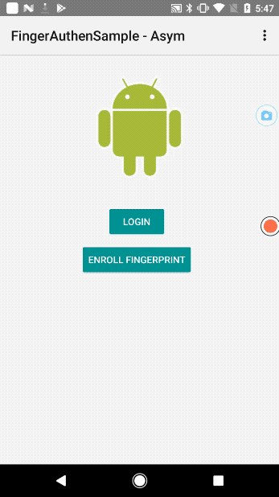

Android AsymmetricFingerprintDialog Sample
===================================

This project is a modified version of [GoogleSamples](https://github.com/googlesamples/android-AsymmetricFingerprintDialog) in order to help a developer to understand how to handle fingerprint authentication in Android application. 

Introduction
------------
This sample demonstrates how you can use registered fingerprints on your mobile device to authenticate with the
server before get access to the data behide authentication.

1. The user has to login using correct password which is hard coded in the application. The password is __MOCK__, this process is just mock up process for usual authentication, and yet this is not the way you will implement on your app.
2. After successful login with the correct password, the application will allow the user to enroll his fingerprints data by pressing __ENROLL FINGERPRINT__ > __SUBMIT__ buttons.
3. After that the user will be able to use his fingerprint to authenticate with the mock-up server.

By performing authentication with fingerprint the user must follow the following conditions:
* The user has to set up __Secure Lock Screen__ which could be _PIN_, _password_, _pattern_, or _fingerprint_ otherwise the application will not allow to login at all.
* The user has to register at least one fingerprint to the mobile phone otherwise the application will not allow to login at all.
* After the user has successfully enroll fingerprints to the application whenever if a new fingerprint has been registered to the mobile phone. The application will force user to perform fingerprint enrollment again.

Application
------------
The application will create a key pair which are private and public key. Once the keys have been generated, the public key will be enrolled to the server and the private key will be stored in KeyStore. While creating a key pair, the keys will be initialized with __setUserAuthenticationRequired(true)__ to allow only authenticated user to access the private key. After successful login using fingerprint, the application will use private key to sign a secret message which could be token, device ID, or other authentication information needed in order to perform login to the server. Anyway, the server should generate a nonce which is a random number for each key enrollment and authentication to prevent replay attack from a malicious user. __setInvalidatedByBiometricEnrollment(true)__ will invalidate the key stored in the KeyStore if a new finger is enrolled to the device.
```
   public void createKeyPair() {
        // The enrolling flow for fingerprint. This is where you ask the user to set up fingerprint
        // for your flow. Use of keys is necessary if you need to know if the set of
        // enrolled fingerprints has changed.
        try {
            mKeyPairGenerator = KeyPairGenerator.getInstance(KeyProperties.KEY_ALGORITHM_EC, "AndroidKeyStore");
        } catch (NoSuchAlgorithmException | NoSuchProviderException e) {
            throw new RuntimeException("Failed to get an instance of KeyGenerator", e);
        }
        try {
            // Set the alias of the entry in Android KeyStore where the key will appear
            // and the constrains (purposes) in the constructor of the Builder
            mKeyPairGenerator.initialize(
                    new KeyGenParameterSpec.Builder(KEY_NAME,
                            KeyProperties.PURPOSE_SIGN)
                            .setDigests(KeyProperties.DIGEST_SHA256)
                            .setAlgorithmParameterSpec(new ECGenParameterSpec("secp256r1"))
                            // Require the user to authenticate with a fingerprint to authorize
                            // every use of the private key
                            .setUserAuthenticationRequired(true)

                            // This will notify the exception when a new finger is enrolled
                            // Mininum API version is 24
                            .setInvalidatedByBiometricEnrollment(true)
                            .build());
            mKeyPairGenerator.generateKeyPair();
        } catch (InvalidAlgorithmParameterException e) {
            throw new RuntimeException(e);
        }
    }
```

Then start listening to a fingerprint on the fingerprint sensor by calling
__FingerprintManager.authenticate__ with a __CryptoObject__ initialized with the asymmetric key pair
created. Or alternatively you can fall back to server-side password based authentication.
```
public void startListening(FingerprintManager.CryptoObject cryptoObject) {
    if (!isFingerprintAuthAvailable()) {
        return;
    }
    mCancellationSignal = new CancellationSignal();
    mSelfCancelled = false;
    // The line below prevents the false positive inspection from Android Studio
    // noinspection ResourceType
    mFingerprintManager
            .authenticate(cryptoObject, mCancellationSignal, 0 /* flags */, this, null);
    mIcon.setImageResource(R.drawable.ic_fp_40px);
}
```

Once the fingerprint is verified, the __FingerprintManager.AuthenticationCallback#onAuthenticationSucceeded()__ callback is called.
```
 @Override
    public void onAuthenticationSucceeded(FingerprintManager.AuthenticationResult result) {
        mErrorTextView.removeCallbacks(mResetErrorTextRunnable);
        mIcon.setImageResource(R.drawable.ic_fingerprint_success);
        mErrorTextView.setTextColor(
                mErrorTextView.getResources().getColor(R.color.success_color, null));
        mErrorTextView.setText(
                mErrorTextView.getResources().getString(R.string.fingerprint_success));
        mIcon.postDelayed(new Runnable() {
            @Override
            public void run() {
                mCallback.onAuthenticated();
            }
        }, SUCCESS_DELAY_MILLIS);
    }
```
The call back will reach __Callback.onAuthenticated()__, in this function the signature of the secret message will be calculated by using __CryptoObject.getSignature().sign()__. Since the fingerprint has been validated, the CryptoObject will utilize private key stored in KeyStore to sign the message for us. The signature will be verified by the server using enrolled public key.
```
@Override
public void onAuthenticated() {
    Log.d("KAPI-DEBUG","[+] Fingerprint recognized");

    // Callback from FingerprintUiHelper. Let the activity know that authentication was
    // successful.
    Signature signature = mCryptoObject.getSignature();

    Transaction transaction = new Transaction(mActivity.getSecretMessage(), new SecureRandom().nextLong());
    try {
        signature.update(transaction.toByteArray());
        byte[] sigBytes = signature.sign();
        if (mStoreBackend.verify(transaction, sigBytes)) {
            mActivity.onSuccessfulLogin(sigBytes);
            dismiss();
        } else {
            mActivity.onLoginFailed();
            dismiss();
        }
    } catch (SignatureException e) {
        throw new RuntimeException(e);
    }
    dismiss();
}
```




------------------------------------------------------------------------------------------------------------
* Read more: 
    * https://github.com/googlesamples/android-AsymmetricFingerprintDialog
